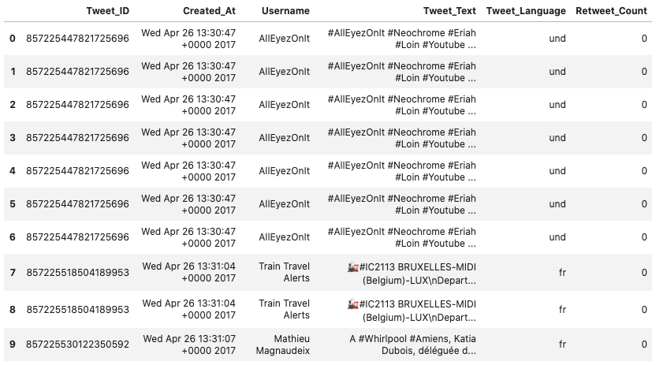
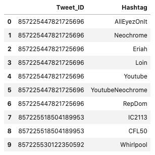
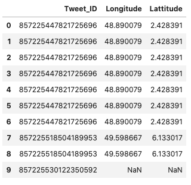
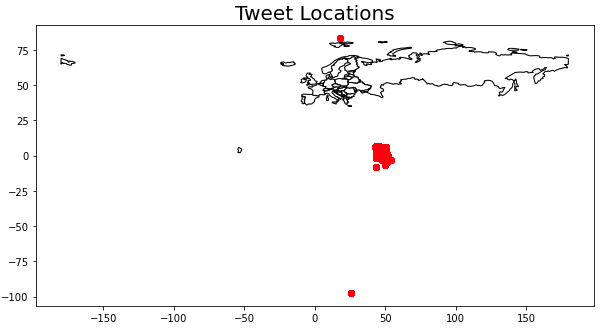
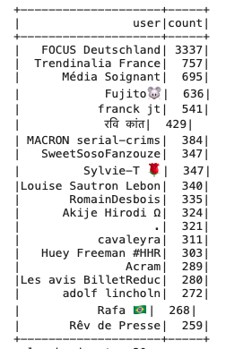
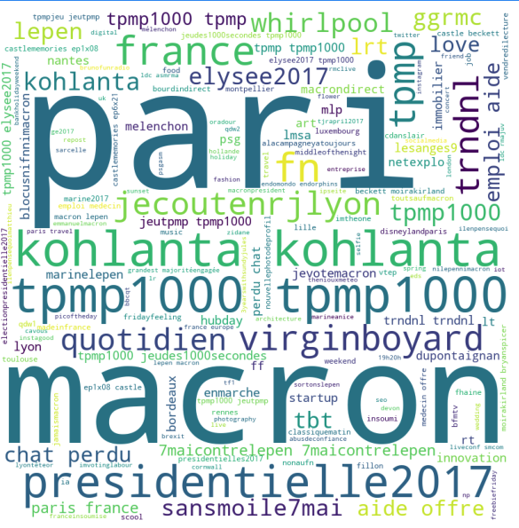
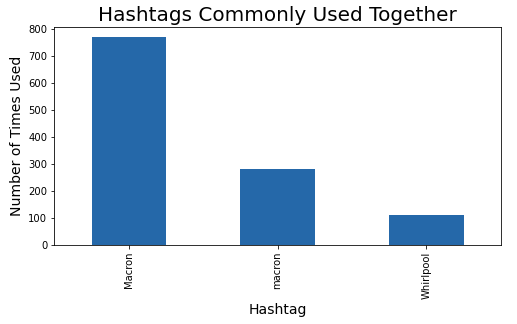

# Twitter Conspiracy - 2017 French Presidential Election

## Background
In 2017, the French Presidential Election had to go to a second round as no candidate won the first election. Emmanuel Macron and Marine Le Pen were the final two candidates in the second round of the French Presidential Election.  The two candidates had drastically different approaches to governing, and as such, the election was a major topic of discussion on Twitter. Along with data showing that Twitter bots may have been used during the campaign in what was called the MacronLeaks disinformation campaign.  

## The Data
We were provided the data in a json file (746 MB) of tweets from France during the second round of election time period. <a href="https://s3.us-east-2.amazonaws.com/jgartner-test-data/twitter/zippedData.zip"> (data)</a>  

## Data Features of Interest
Upon first inspection of the data, it was overwhelming. We looked through the dataframe schema to determine which columns would be intersting to us. We focused in on:  
- **Geo.Coordinates**: location of user when tweet was published  
- **Entities.Hastags**: hashtags used in tweet  
- **Text**: text in the tweet  
- **Language**: language of the tweet  
- **Created At**: timestamp of the tweet

## Exploratory Data Analysis
We created several helper functions, located in the python document in the src folder, to clean the data and obtain dataframes that were easy to work with. 

After converting the data into specialized sql spark dataframes, we transitioned them to pandas dataframes to easily view our data and start creating visualizations.   

**Tweet Dataframe**  

  

**Hashtag Dataframe**  

  

**Tweet Location Dataframe**  

## Results & Conclusions  

It was interesting to see the locations from where the tweets were made:  

  

A few people generated most of the tweets, apparently from outside France
 

Most used hashtags among the 95,000 hashtags used:  

After looking through the most used hashtags and our dataframes, we noticed there were a lot of tweets with both 'Macron' and 'Whirlpool' as hashtags. We investigated Whirlpool and Macron: 
- In April, Marine Le Pen visited a failing Whirlpool factory in Northern France, which upstaged Macron during the election season, gaining support from the factory workers. Macron then tried to stay even, and visited the factory to meet with angry workers. He entered the picket line and trie to explain a plan for the workers to keep their jobs.  It was a big media move for the two candidates.
  

